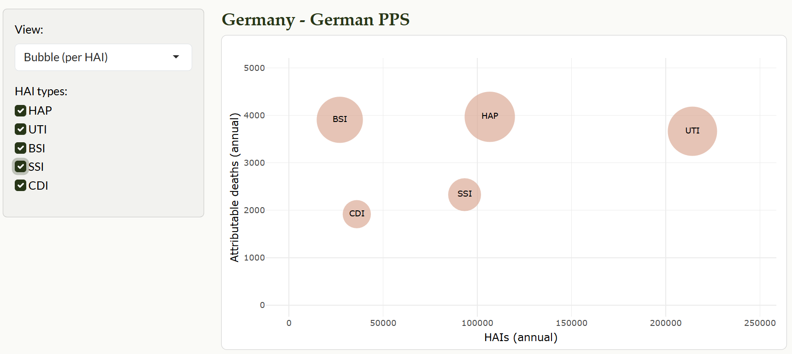
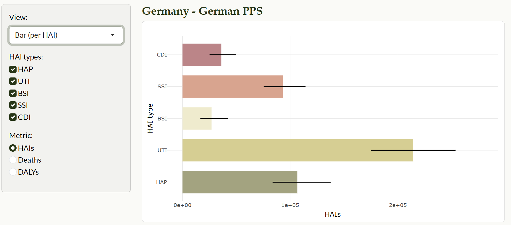
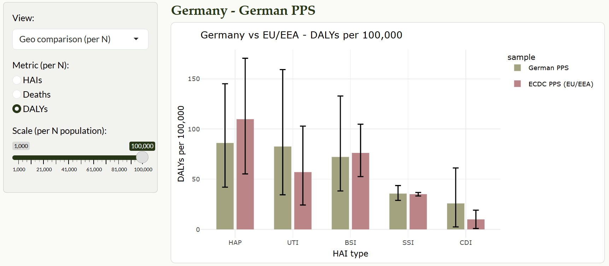
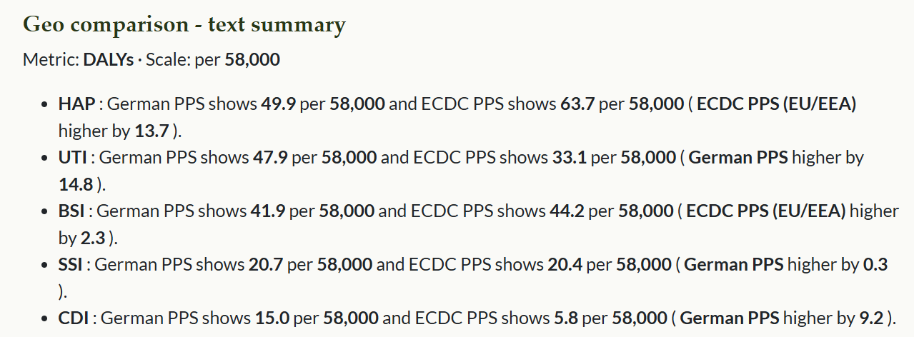

```{r, include = FALSE}
knitr::opts_chunk$set(
  collapse = TRUE,
  comment = "#>"
)
```

<style>
.img-frame { border:1px solid #ddd; padding:8px; border-radius:10px; background:#fff; box-shadow:0 1px 3px rgba(0,0,0,.06); }
</style>

## Overview

BHAIBYE is a small teaching package with an interactive Shiny app and two
tidy datasets to explore the burden of healthcare-associated infections (HAIs)
in Germany and the EU/EEA. You can:

- browse per-HAI totals (bubble / bar),

- compare Germany vs EU/EEA at rates per N people (with a slider),

- view 95% uncertainty intervals (UI) everywhere they matter.

This vignette shows how to load the data and how to use the app effectively.

## Installation

```r
install.packages("pak")
pak::pak("ETC5523-2025/assignment-4-packages-and-shiny-apps-ruby910113")
```

Load the package:

```r
library(BHAIBYE)
```

## What data are included?

Two compact data frames ship with the package:

- `bhai_summary` - annual totals for Germany (German PPS) by HAI type
with point estimates and 95% UI.

- `bhai_rates` - rates per 100,000 for Germany (German PPS) and EU/EEA
(ECDC PPS), by HAI type and metric (HAIs, Deaths, DALYs), with 95% UI.

### Column guide

- `geo`, `sample`, `hai` - geography, survey label, HAI type

- `cases`, `deaths`, `dalys` - point estimates (annual totals)

- `_low`, `_high` - lower/upper 95% UI

- in `bhai_rates`: metric ∈ {`HAIs`, `Deaths`, `DALYs`}, `per100k`, `per100k_low`, `per100k_high`

## Launch the Shiny app

The interactive explorer lives under inst/shiny/.

```r
BHAIBYE::launch_app()
```

## App tour (what each view shows)

- Bubble (per HAI)

    - X = annual HAIs (cases), Y = attributable deaths; bubble size = DALYs.
    
    - Hover tooltips show 95% UI for cases / deaths / DALYs.

- Bar (per HAI)
    
    - Choose metric (HAIs / Deaths / DALYs). Bars are colour-coded by HAI type.
    
    - Vertical error bars = 95% UI.

- Geo comparison (per N)
    
    - Compare German PPS vs ECDC PPS (EU/EEA) for the chosen metric, as rates per N people. Use the slider to change N (e.g. 1,000 … 100,000).

    - Error bars show 95% UI. Overlapping intervals suggest limited separation.
    
    - Read the **summary text under the plot**: for each HAI it prints  
    
        - **Type** - **German PPS** shows **X** per **N** and **ECDC PPS** shows **Y** per **N** (**[Who’s higher] by Δ**).  
   
        - This updates live when you move the slider or switch metric (it will also say **Tie** when values are equal).
    
## Example: Exploring the burden of HAIs interactively

The **BHAIBYE** app helps answer common questions about healthcare-associated infections (HAIs) in Germany and the EU/EEA.  
Below are example questions and how you can explore them using the app.

### 💡 Question 1: How do total HAIs, attributable deaths, and DALYs compare across infection types?

1. In the sidebar, under **View**, select **Bubble (per HAI)**.

2. Each bubble represents one infection type (HAP, UTI, BSI, SSI, CDI).

    a. The x-axis shows total annual HAIs.

    b. The y-axis shows attributable deaths.

    c. The bubble size shows DALYs (combined YLL + YLD).

3. Hover your mouse over any bubble to see the exact numbers, including 95% uncertainty intervals.

4. Use the **HAI types** checkboxes to filter and compare only selected infections.

**Illustrative Figure**:

```{r}
#| echo: false
#| out.width: "80%"
#| fig.align: "center"
#| fig.cap: "Example - Bubble (per HAI): x = HAIs, y = deaths, size = DALYs (95% UI on hover)."
#| fig.alt: "Bubble chart showing HAIs on x-axis, deaths on y-axis, bubble size for DALYs; hover shows 95% UI."
#| out.extra: 'class="img-frame"'


```

### 💡 Question 2: How do infection types contribute to DALYs, Deaths, and HAIs in Germany?

1. In the sidebar, set **View** to **Bar (per HAI type)**.

2. Under **Metric**, choose the measure you want to explore (**DALYs, Deaths, or HAIs**).

3. The chart displays total annual values by HAI type, with error bars indicating 95% uncertainty intervals.

4. **Hover** over any bar to see exact numbers, including the 95% uncertainty interval.

5. Use the **HAI types** checkboxes to filter and compare selected infections.

**Illustrative Figure**:

```{r}
#| echo: false
#| out.width: "80%"
#| fig.align: "center"
#| fig.cap: "Example - Bar (per HAI type): totals by infection type with 95% uncertainty intervals."
#| fig.alt: "Bar chart of HAI types with error bars indicating 95 percent uncertainty intervals."
#| out.extra: 'class="img-frame"'


```

    
### 💡 Question 3: How does Germany compare with the EU/EEA overall?

1. In the sidebar, set **View** to **Geo comparison (per N)**.

2. Under **Metric**, choose the measure you want to explore (**HAIs, Deaths or DALYs**).

3. Adjust the **Scale (per N population)** slider to rescale the rates (e.g., per 100,000).

4. The bar chart shows Germany vs. EU/EEA for each HAI type.

5. Read the text summary below the chart, which automatically highlights which region has higher rates and by how much.

**Illustrative Figure (Bar)**:

```{r}
#| echo: false
#| out.width: "80%"
#| fig.align: "center"
#| fig.cap: "Example - Germany vs EU/EEA: bar comparison by HAI type, scaled per N population."
#| fig.alt: "Bar comparison of Germany and EU/EEA across infection types with per-capita scaling."
#| out.extra: 'class="img-frame"'


```

**Illustrative Figure (Summary)**:

```{r}
#| echo: false
#| out.width: "80%"
#| fig.align: "center"
#| fig.cap: "Example - Auto-generated summary highlighting which region is higher and by how much."
#| fig.alt: "Autogenerated textual summary indicating which region has higher values and the magnitude."
#| out.extra: 'class="img-frame"'


```


## Sources

Eurosurveillance article: <https://www.eurosurveillance.org/content/10.2807/1560-7917.ES.2019.24.46.1900135#html_fulltext>

## Package Structure

```r
assignment-4-packages-and-shiny-apps-ruby910113/
├─ ETC5523_assignment4.Rproj               
├─ R/
│  ├─ launch_app.R          # exported launcher
│  └─ BHAIBYE.R             # package-level docs
├─ inst/
│  └─ shiny/
│     ├─ app.R              # main app
│     └─ www/
│        └─ app.css         # custom styles
├─ data/ 
│  ├─ bhai_summary.rda      # HAI totals
│  └─ bhai_rates.rda        # Rates per 100,000 
├─ data-raw/ 
│  └─ bhai_dataset.R        # reads/cleans sources → saves .rda
├─ vignettes/
│  └─ BHAIBYE.Rmd           # “Getting started / app tour” vignette
├─ man/                     # Rd documentation generated by roxygen2
|  ├─ bhai_summary.Rd
|  ├─ bhai_rates.Rd
│  └─ launch_app.Rd
├─ pkgdown/                 # site configuration 
│  ├─ _pkgdown.yml
│  └─ index.md              # Project homepage
├─ docs/                    # pkgdown site output
├─ README.Rmd               # README file for github
├─ README.md                # rendered by README.Rmd
├─ DESCRIPTION              # package metadata (title, version, authors)
├─ NAMESPACE                # exports/imports (auto-generated by roxygen2)
├─ LICENSE                  # SPDX short license file
├─ LICENSE.md               # full license text 
├─ .github
├─ .Rbuildignore            # files to ignore during build
└─ .gitignore               # files to ignore in Git
```

## Acknowledgements

This package was produced in the context of an academic assignment.

Package scaffolding and documentation were made much easier thanks to the R packaging ecosystem - particularly **usethis**, **devtools**, and **roxygen2**.  
Interactive exploration is built with **shiny**, **plotly**, and **ggplot2**; data wrangling and utilities rely on **dplyr**, **tidyr**, and **scales**; theming uses **bslib**.

Concepts, data structure, and interpretation follow the BHAI approach described by Zacher et al. (2019) in *Eurosurveillance*:  
<https://www.eurosurveillance.org/content/10.2807/1560-7917.ES.2019.24.46.1900135#html_fulltext>

Please refer to the package **LICENSE** file for terms of use and redistribution. Any mistakes or oversights are my own.
