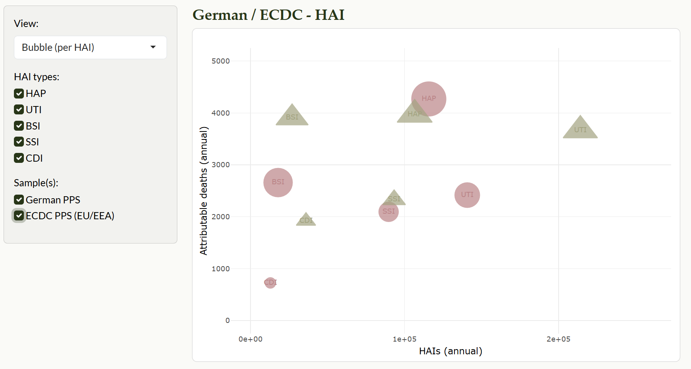
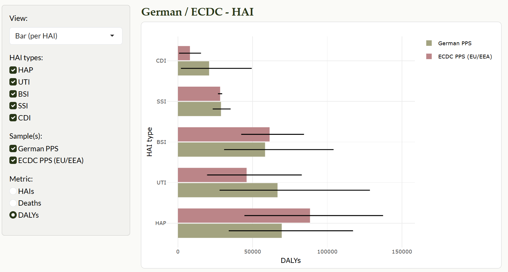
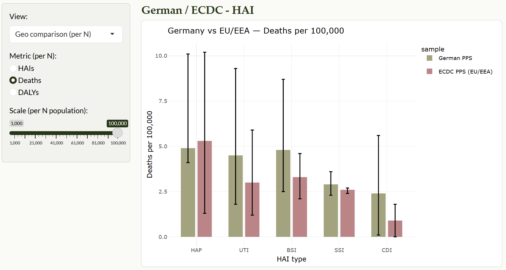
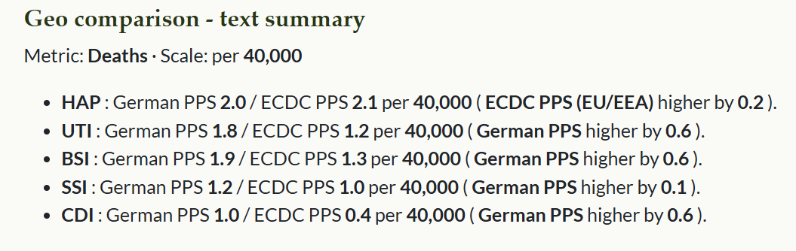
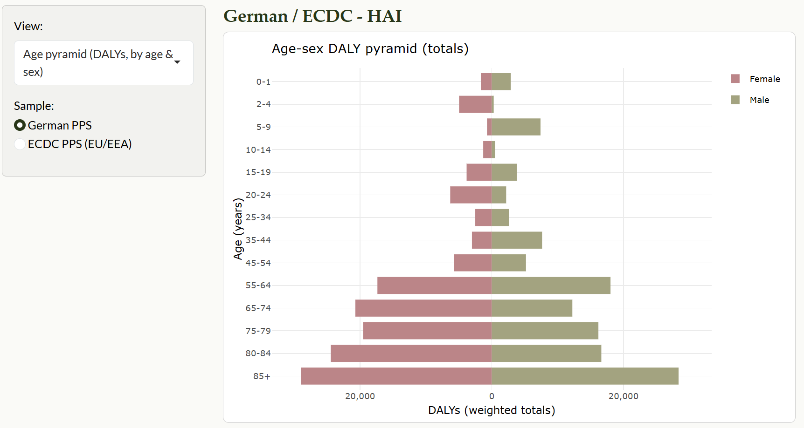

```{r, include = FALSE}
knitr::opts_chunk$set(
  collapse = TRUE,
  comment = "#>"
)
```

<style>
.img-frame { border:1px solid #ddd; padding:8px; border-radius:10px; background:#fff; box-shadow:0 1px 3px rgba(0,0,0,.06); }
</style>

## Overview

**BHAIBYE** is a teaching-focused R package with an **interactive Shiny app** for visualising the burden of healthcare-associated infections (HAIs), and **four tidy datasets** for Germany and the EU/EEA.

**You can:**

- browse per-HAI totals (bubble / bar),

- compare Germany vs EU/EEA at rates per N people (with a slider),

- view 95% uncertainty intervals (UI) where relevant.


> **Provenance & disclaimer**  
All datasets in BHAIBYE are simulated for teaching.
They are constructed to resemble aggregate patterns reported in the literature, but are not original survey microdata and must not be used for real-world inference or policy analysis.

## Installation

```r
install.packages("pak")
pak::pak("ETC5523-2025/assignment-4-packages-and-shiny-apps-ruby910113")
```

Load the package:

```r
library(BHAIBYE)
```

## What data are included?

BHAIBYE ships four compact datasets:

- `bhai_summary` - **Germany totals** by HAI type (point + 95% UI; DALY components YLL/YLD).

- `bhai_rates` - **Rates per 100,000** for Germany (German PPS) and EU/EEA (ECDC PPS), long by metric (HAIs, Deaths, DALYs) with 95% UI.

- `bhai_cases_de` - **Simulated person-level microdata (Germany)** with weights to re-aggregate to totals.

- `bhai_cases_eu` - **Simulated person-level microdata (EU/EEA)** with the same schema as `bhai_cases_de`.

See the full schema in the [**Data dictionary**](data-dictionary.html)
and see worked examples of `implied_pop_de()`, `totals_for_sample()`, and `pyramid_df()` in the [**Functions in BHAIBYE**](bhaibye_functions.html)

## Launch the Shiny app

The interactive explorer lives under inst/shiny/.

```r
BHAIBYE::launch_app()
```

## App tour (what each view shows)

- **Bubble (per HAI)**

    - Choose **Sample** *(German PPS or ECDC PPS (EU/EEA))*.
    
        - German PPS uses published Germany totals.
      
        - ECDC PPS converts per-100k rates to approximate totals using an *implied Germany-scale population* (see `implied_pop_de()`).

    - X = annual HAIs (cases), Y = attributable deaths; bubble size = DALYs.
    
    - Hover tooltips show 95% UI for cases / deaths / DALYs.
    
```{r}
#| echo: false
#| out.width: "80%"
#| fig.align: "center"
#| fig.cap: "Example - Bubble (per HAI): x = HAIs, y = deaths, size = DALYs (95% UI on hover)."
#| fig.alt: "Bubble chart: HAIs on x-axis, deaths on y-axis, bubble size for DALYs; hover shows 95% UI."
#| out.extra: 'class="img-frame"'

```

- **Bar (per HAI)**

    - Choose **Sample** *(German PPS or ECDC PPS (EU/EEA))*.
    
        - German PPS uses published Germany totals.
      
        - ECDC PPS converts per-100k rates to approximate totals using an *implied Germany-scale population* (see `implied_pop_de()`).
    
    - Choose metric (HAIs / Deaths / DALYs). Bars are colour-coded by HAI type.
    
    - Vertical error bars = 95% UI.
    
```{r}
#| echo: false
#| out.width: "80%"
#| fig.align: "center"
#| fig.cap: "Example - Bar (per HAI type): totals by infection type with 95% UI."
#| fig.alt: "Bar chart of HAI types with 95% UI error bars."
#| out.extra: 'class="img-frame"'

```

- **Geo comparison (per N)**
    
    - Compare Germany vs EU/EEA for the chosen metric at rates per N people.

    - Use the slider to adjust N (e.g., 1,000 … 100,000).

    - The app also prints a text summary clarifying which region is higher and by how much (or Tie).
    
```{r}
#| echo: false
#| out.width: "80%"
#| fig.align: "center"
#| fig.cap: "Example - Germany vs EU/EEA: bar comparison by HAI type, scaled per N population."
#| fig.alt: "Bar comparison of Germany and EU/EEA across infection types with per-capita scaling."
#| out.extra: 'class="img-frame"'

```
    
```{r}
#| echo: false
#| out.width: "80%"
#| fig.align: "center"
#| fig.cap: "Example - Auto-generated summary showing who is higher and the difference."
#| fig.alt: "Text summary indicating which region has higher values and the magnitude."
#| out.extra: 'class="img-frame"'

```
    
- **Age pyramid**

    - Choose **Sample** *(German PPS or ECDC PPS (EU/EEA))*.
    
    - Optionally filter **HAI types**; the pyramid aggregates **weighted DALYs** across the selected infections.
    
    - Bars show **DALYs by age group and sex**, computed from the simulated microdata
      (`bhai_cases_de` / `bhai_cases_eu`) using population weights (via `pyramid_df()`).
    
    - Hover tooltips report DALYs for each age–sex bin. Small Monte-Carlo differences vs totals are expected.

```{r}
#| echo: false
#| out.width: "80%"
#| fig.align: "center"
#| fig.cap: "Example - Age pyramid: weighted DALYs by age group and sex (simulated microdata)."
#| fig.alt: "Two-sided age pyramid showing weighted DALYs by age group for females and males."
#| out.extra: 'class="img-frame"'

```

## Sources

Eurosurveillance article: <https://www.eurosurveillance.org/content/10.2807/1560-7917.ES.2019.24.46.1900135#html_fulltext>

## Package Structure

```r
assignment-4-packages-and-shiny-apps-ruby910113/
├─ ETC5523_assignment4.Rproj               # RStudio project file
├─ R/
│  ├─ launch_app.R          # Exported launcher that opens the Shiny app in inst/shiny
│  ├─ bhai_cases_de.R       # Roxygen docs for dataset: simulated DE microdata (age/sex, weights)
│  ├─ bhai_cases_eu.R       # Roxygen docs for dataset: simulated EU/EEA microdata (same schema as DE)
│  ├─ bhai_rates.R          # Roxygen docs for dataset: per-100k rates (long format; DE & EU/EEA)
│  ├─ bhai_summary.R        # Roxygen docs for dataset: DE totals + 95% UI + YLL/YLD components
│  ├─ implied_pop_de.R      # Internal helper: back-calc implied DE population from totals & “All” rate
│  ├─ pyramid_df.R          # Internal helper: aggregate weighted DALYs by age × sex for pyramids
│  ├─ totals_for_sample.R   # Internal helper: build totals/UI for chosen sample (DE or EU/EEA)
│  ├─ globals.R             # Global vars/constants; utils::globalVariables() to silence NSE notes
│  └─ BHAIBYE.R             # Package-level docs and vignette pointers (not exported)
├─ inst/
│  └─ shiny/
│     ├─ app.R              # Main Shiny app (UI/server), reads package data & helpers
│     └─ www/
│        └─ app.css         # Custom CSS styles for the app (Bootstrap/BSlib friendly)
├─ data/ 
│  ├─ bhai_summary.rda      # Serialized DE totals dataset (for ?bhai_summary)
│  ├─ bhai_rates.rda        # Serialized rates dataset (for ?bhai_rates)
│  ├─ bhai_cases_de.rda     # Serialized simulated DE microdata (for ?bhai_cases_de)
│  └─ bhai_cases_eu.rda     # Serialized simulated EU/EEA microdata (for ?bhai_cases_eu)
├─ data-raw/ 
│  └─ bhai_dataset.R        # Repro script to build/clean data → saves .rda (not run on install)
├─ vignettes/
│  ├─ BHAIBYE.Rmd           # “Getting started / app tour” vignette
│  ├─ bhaibye_function.Rmd  # Functions vignette (internal helpers usage & examples)
│  └─ data-dictionary.Rmd   # Data dictionary vignette (schema + quick peeks)
├─ man/                     # Rd reference generated by roxygen2
│  ├─ bhai_summary.Rd       # Help page for DE totals dataset
│  ├─ bhai_rates.Rd         # Help page for rates dataset
│  ├─ bhai_cases_de.Rd      # Help page for DE microdata
│  ├─ bhai_cases_eu.Rd      # Help page for EU/EEA microdata
│  └─ launch_app.Rd         # Help page for launch_app()
├─ pkgdown/                 
│  ├─ _pkgdown.yml          # Site configuration (navbar, reference, articles, theme)
│  └─ index.md              # Home page content for the pkgdown site
├─ docs/                    # Built pkgdown site output (served by GitHub Pages)
├─ README.Rmd               # Source README for GitHub (knit to README.md)
├─ README.md                # Rendered README (badges, install, examples)
├─ DESCRIPTION              # Package metadata (title, version, authors, imports, etc.)
├─ NAMESPACE                # Auto-generated exports/imports (do not edit by hand)
├─ LICENSE                  # SPDX short license identifier (MIT + file LICENSE)
├─ LICENSE.md               # Full MIT license text
├─ .github                  # CI/workflows (e.g., pkgdown GH Actions) if configured
├─ .Rbuildignore            # Files/dirs excluded from R CMD build
└─ .gitignore               # Git ignores (e.g., docs/, .Rproj.user/, .DS_Store)
```

## Acknowledgements

This package was produced in the context of an academic assignment.

All datasets in this package are simulated by me for teaching and demonstration purposes. The person-level microdata (bhai_cases_de, bhai_cases_eu) are synthetic draws calibrated to approximate published aggregates; the totals and rates (bhai_summary, bhai_rates) are compact representations derived for this package. **They are not official statistics, may differ from the source study, and should not be used for clinical or policy decisions**.

Package scaffolding and documentation were made much easier thanks to the R packaging ecosystem - particularly **usethis**, **devtools**, and **roxygen2**.  
Interactive exploration is built with **shiny**, **plotly**, and **ggplot2**; data wrangling and utilities rely on **dplyr**, **tidyr**, and **scales**; theming uses **bslib**.

Concepts, data structure, and interpretation follow the BHAI approach described by Zacher et al. (2019) in *Eurosurveillance*:  
<https://www.eurosurveillance.org/content/10.2807/1560-7917.ES.2019.24.46.1900135#html_fulltext>

Please refer to the package **LICENSE** file for terms of use and redistribution. Any mistakes or oversights are my own.
